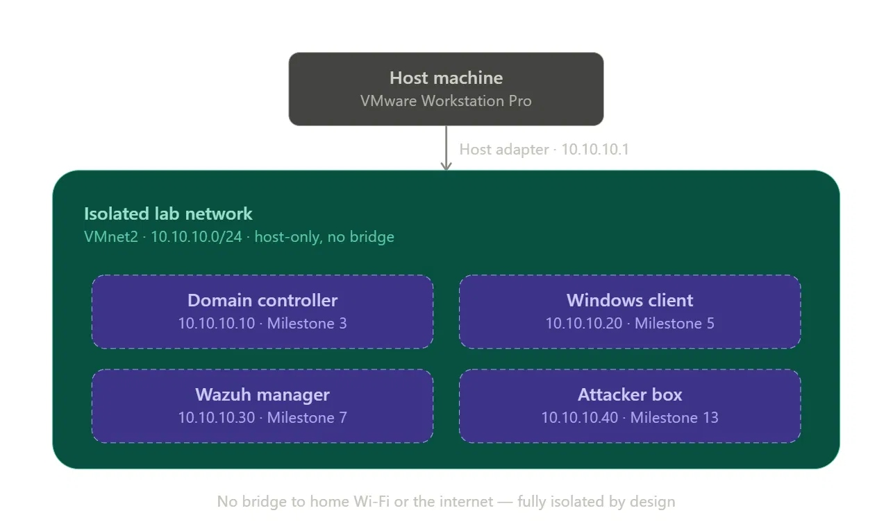

# SIEM Home Lab

A documented, end-to-end detection engineering lab: Active Directory, Sysmon-instrumented
endpoints, a Wazuh SIEM, custom detection rules mapped to MITRE ATT&CK, and adversary
simulation to prove those detections fire.

Built as the practical extension of my MSc dissertation, *Measuring the Informativeness of
Detection Rule Descriptions: A Corpus-Based Study of SigmaHQ, MITRE ATT&CK, and the Cyber
Analytics Repository* (Newcastle University, 2026). The dissertation measured how well
detection logic is explained. This lab holds my own detections to that standard.

**Status: 3 of 20 milestones complete — Phase 1 of 5 in progress**

---

## Running today

| Component | Address | State |
|---|---|---|
| Isolated lab network (VMnet2, `10.10.10.0/24`, DHCP disabled) | — | Built, verified |
| `DC01` — Windows Server 2025, AD DS forest `lab.local` | `10.10.10.10` | Built, verified |

`DC01` holds all five FSMO roles, serves authoritative DNS for `lab.local`, acts as global
catalog and Kerberos KDC, and exposes the SYSVOL and NETLOGON shares that Group Policy
depends on. Forest and domain functional levels are Windows Server 2025.

Every claim above was verified from the command line rather than taken from a wizard summary
— FSMO ownership via `netdom query fsmo`, service state, share existence, all four DC Locator
SRV records resolved, and directory health via `dcdiag`. Network isolation was confirmed
directly (no default route, external resolution fails, no egress) rather than inferred from
`dcdiag` reporting root hints as reachable.

Full write-up: [`docs/03-domain-controller/notes.md`](docs/03-domain-controller/notes.md)

---

## Target architecture



| Machine | Address | Role | Milestone |
|---|---|---|---|
| Host | `10.10.10.1` | Hypervisor, bridge into the lab | 1–2 ✅ |
| `DC01` | `10.10.10.10` | Domain controller, DNS, KDC, global catalog | 3 ✅ |
| Windows client | `10.10.10.20` | Domain-joined endpoint, Sysmon-instrumented | 5 |
| Wazuh manager | `10.10.10.30` | SIEM — log ingestion, rules, alerting | 7 |
| Attacker box | `10.10.10.40` | Atomic Red Team execution | 13 |

The subnet is deliberately `10.10.10.0/24` rather than a common home range
(`192.168.0.0/24`, `192.168.1.0/24`) so lab traffic is immediately identifiable when reading
logs later. The network is host-only with no bridge to a physical network or the internet.

Host: Windows 11, Intel i7-14650HX, 16 GB RAM, VMware Workstation Pro.

---

## Roadmap

### Phase 1 — Lab foundations
| # | Milestone | Status |
|---|---|---|
| 1 | Host and hypervisor setup | ✅ 91/100 |
| 2 | Isolated lab network design | ✅ 96/100 |
| 3 | Windows Server install + AD DS promotion | ✅ 93/100 |
| 4 | AD structure: OUs, users, groups, baseline GPO | Next |
| 5 | Windows client build and domain join | |

### Phase 2 — Telemetry pipeline
| # | Milestone |
|---|---|
| 6 | Sysmon install and configuration |
| 7 | Wazuh manager deployment |
| 8 | Wazuh agent deployment and enrolment |
| 9 | Log ingestion validation |

### Phase 3 — Detection engineering
| # | Milestone |
|---|---|
| 10 | Wazuh rule/decoder architecture + ATT&CK coverage mapping |
| 11 | Custom detection rule: write, test, validate |
| 12 | Rule tuning and detection documentation standard |

### Phase 4 — Attack simulation and threat hunting
| # | Milestone |
|---|---|
| 13 | Atomic Red Team setup |
| 14 | Run ATT&CK technique tests, confirm detections fire |
| 15 | Multi-stage attack chain and manual threat hunt |
| 16 | Gap analysis and new rules to close detection gaps |

### Phase 5 — Portfolio packaging
| # | Milestone |
|---|---|
| 17 | Architecture diagram and full screenshot pass |
| 18 | Detection logic write-up and ATT&CK mapping table |
| 19 | Lessons learned and future improvements |
| 20 | Final review, scoring, publish |

---

## How this is documented

Each milestone records the objective, why it matters operationally, the concepts involved,
the exact commands used, screenshot evidence, and a score out of 100 against a fixed
checklist. Deductions are carried forward as named follow-up items rather than quietly
dropped.

Two principles the write-ups try to hold to:

**Verify, don't assume.** A wizard reporting success is a claim, not evidence. Milestone 3
includes a case where `dcdiag` reported all thirteen internet root servers reachable on an
air-gapped network — investigating rather than accepting it confirmed the tool was validating
configuration, not connectivity.

**Document failures, not just outcomes.** The AD DS promotion failed its prerequisites check
on a blank local Administrator password. That failure, its underlying cause, and the fix are
in the write-up, because the diagnosis is more informative than a clean run would have been.

Documentation depth increased from Milestone 3 onward, when the scoring checklist was
formalised. Milestones 1 and 2 are recorded more briefly and will be backfilled to the same
standard.

---

## Repository structure

```
docs/
  01-host-hypervisor-setup/     Host prep, VMware, virtualization conflict diagnosis
  02-lab-network-design/        VMnet2, addressing plan, architecture diagram
  03-domain-controller/         AD DS forest promotion and validation
scripts/
  install-addsforest.ps1        Exported forest promotion, reproducible
  validate-dc-promotion.ps1     Post-promotion validation checks
```

---

## Author

**Miran Mansuri** — MSc Cybersecurity, Newcastle University (2026).
Building toward a UK SOC analyst / detection engineering role.

[LinkedIn](https://www.linkedin.com/in/miran-mansuri) ·
[Credly](https://www.credly.com/users/miran-mansuri)
